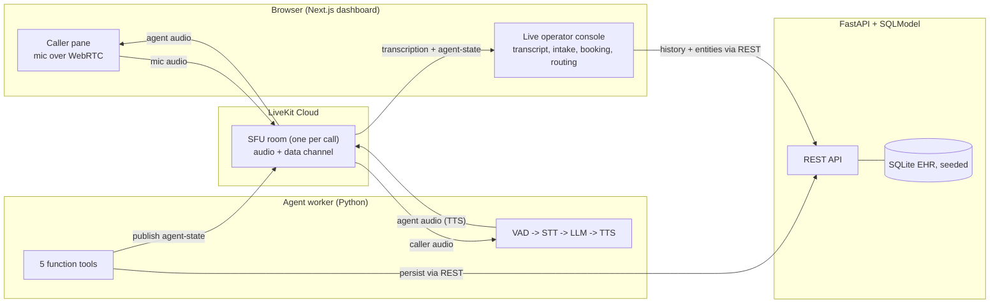
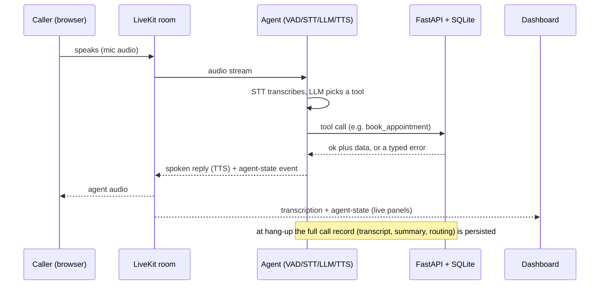
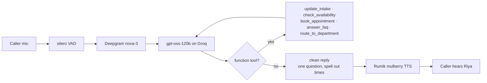

# ClinicFlow

An AI Healthcare Receptionist: a real-time voice agent that answers patient calls,
runs intake, books appointments, answers FAQs, and routes callers to the right
department, paired with a live, SaaS-quality dashboard that mirrors every call as
it happens.

## Demo video

**[Watch the 2-minute demo on Loom](https://www.loom.com/share/7459d24730ec416e8b25cc924d598c29)**

A full call from greeting through intake, booking, an FAQ, and department routing,
with the dashboard updating live and the recording played back from history.

## Highlights

- Real-time bidirectional voice with barge-in and an instant cached greeting.
- Live, streaming dashboard: transcript, patient intake, availability and booking,
  a department-routing switchboard, and a conversation timeline, all driven by the
  agent's own tool calls (no scripted animation).
- Emergency override: red-flag symptoms skip intake and route to Emergency at once.
- Deterministic guardrails on top of the LLM: it records only what the caller
  actually says, asks one thing at a time, will not offer appointment times before
  intake is complete, and never claims a booking a tool did not confirm.
- Call controls: mute/pause (the agent waits), end, and a post-call view with
  recording playback and an editable patient record.
- Full persistence: every call is saved to SQLite and archived as JSON (transcript
  plus patient details), with the audio recording, browsable in a History view.

## Architecture

Three deployable units meeting at LiveKit. One LiveKit room per call. The browser
both places the "incoming call" (publishes the mic) and renders the dashboard off
that same connection, because the agent forwards transcriptions and structured
`agent-state` events to every participant. So everything real-time rides on
transport LiveKit already provides, with no custom WebSocket server. FastAPI
handles persistence only and never touches the audio path. Intake, availability,
booking, FAQ logging, and routing are all LLM function tools, so every state change
is an auditable tool call that also drives the UI.

### System topology



### One call, end to end



### Agent pipeline



## Tech stack

- **Voice framework:** LiveKit Agents (Python), with the official Rumik plugin.
- **Pipeline:** silero VAD, Deepgram `nova-3` STT, `openai/gpt-oss-120b` on Groq's
  OpenAI-compatible endpoint, Rumik `mulberry` TTS. Providers are swappable via env
  (`LLM_MODEL`, `LLM_BASE_URL`).
- **Backend:** FastAPI + SQLModel + SQLite (seeded EHR). Persistence only, never in
  the audio path.
- **Dashboard realtime:** LiveKit only: `lk.transcription` text streams plus
  `agent-state` data-channel messages. No custom WebSocket server.
- **Frontend:** Next.js (App Router) + Tailwind + shadcn/ui + Framer Motion.
  Zustand for live call state (a pure reducer over agent-state events), TanStack
  Query for REST entities.

The `agent-state` event schema is the single dashboard contract, mirrored in
`agent/state.py` and `web/lib/types.ts`.

## Repository layout

```
agent/     LiveKit Agents worker (Python): pipeline + function tools
server/    FastAPI persistence API + SQLite (seeded)
web/       Next.js dashboard (components/, hooks/, stores/, lib/)
```

## Prerequisites

- Node 20+ and npm
- [uv](https://docs.astral.sh/uv/) (manages Python 3.12 for the two Python packages)
- API keys: LiveKit Cloud, Rumik, Deepgram, Groq (OpenAI works as an LLM fallback)

## Setup

```bash
make setup                                 # install deps for server, agent, and web
cp server/.env.example server/.env
cp agent/.env.example  agent/.env
cp web/.env.local.example web/.env.local   # fill in your keys
```

`LIVEKIT_URL`, `LIVEKIT_API_KEY`, and `LIVEKIT_API_SECRET` must be the same LiveKit
project across `server/.env` and `agent/.env`.

## Run

```bash
make reset      # clean demo state: wipe + reseed the DB, clear recordings
```

Then, each in its own terminal:

```bash
make server     # FastAPI on http://localhost:8000 (auto-seeds on first boot)
make agent      # LiveKit agent worker
make web        # dashboard on http://localhost:3000
```

Open http://localhost:3000, click **Start call**, allow the mic, and talk to Riya.
See `DEMO.md` for a copy-and-speak demo script.

Other commands: `make console` (talk to the agent via the local mic, no browser),
`make verify` (deterministic booking + provider smoke tests), `make seed` (reseed).

## Deliberate mocks (with real upgrade paths)

Stated openly: these are scoped for a one-machine demo, each with a clear path to
production.

- **Telephony** -> browser WebRTC. A SIP trunk and a carrier number is a config
  change, not a code change.
- **EHR** -> seeded SQLite behind a real integration seam. Swap in an FHIR client.
- **Recording** -> client-side MediaRecorder instead of LiveKit Egress.
- **Department transfer** -> status change + visualization (no second agent).

## Engineering notes

Most of the hard problems were provider-behavior quirks, not app logic (the LLM
role-playing the caller, rushing ahead of intake, or mis-formatting times). The
consistent fix is a deterministic guardrail in the tool layer on top of the prompt,
because a prompt instruction is not a guarantee: `check_availability` refuses until
intake is complete, a fabricated phone number is rejected unless the caller actually
spoke those digits, and the spoken reply is cleaned to one question with times
spelled out. The call record is persisted the moment the caller hangs up, not on
worker shutdown, so history is complete immediately.

## Troubleshooting

- **The agent goes silent mid-call.** Usually Groq's free-tier rate limit
  (`gpt-oss-120b` is capped at 8000 tokens/minute); check `runs/agent.log` for a
  `429`. Upgrade the Groq tier, or switch the model with one line in `agent/.env`:
  set `LLM_MODEL`/`LLM_BASE_URL` to a higher-limit endpoint (for example OpenAI
  `gpt-4o-mini` with your `OPENAI_API_KEY`).
- **No greeting / no audio in the browser.** Browsers block autoplay until a
  gesture; the greeting unlocks on the **Start call** click. If a "Tap anywhere to
  enable sound" hint appears, tap once. Make sure you are not muted (the banner
  says so) and allow microphone access.
- **Nothing happens on Start call.** Confirm all three services are up and the
  LiveKit keys match across `server/.env` and `agent/.env`.

## Run logs

Service logs, per-call JSON (transcript + patient details), and recordings are
written under `runs/` so a session can be reviewed afterward. The directory is
tracked; its contents are gitignored.
