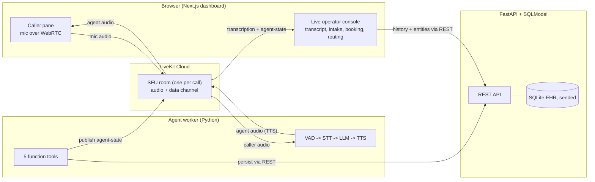
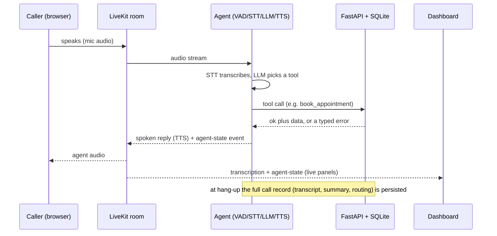
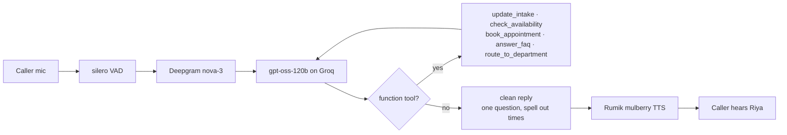

# ClinicFlow

An AI Healthcare Receptionist: a real-time voice agent that answers patient calls,
runs intake, books appointments, answers FAQs, and routes callers to the right
department, paired with a live, SaaS-quality dashboard that mirrors every call as
it happens.

## Demo videos

**[1. Full call walkthrough (2 min)](https://www.loom.com/share/7459d24730ec416e8b25cc924d598c29)**

A full call from greeting through intake, booking, an FAQ, and department routing,
with the dashboard updating live and the recording played back from history.

**[2. Testing emergency routing and guardrails](https://www.loom.com/share/516f5a9c228948d6bd49bad9cf5ae161)**

A red-flag symptom skips intake and routes straight to the Emergency ward with a
clinician handoff, alongside the agent's scope and safety guardrails.

## Highlights

- Real-time bidirectional voice with barge-in and an instant cached greeting.
- Every call is timed: the pause the caller hears is broken down per stage
  (endpointing, transcription, LLM first token, TTS first audio) and reported
  as p50/p95 with `make latency`.
- Live, streaming dashboard: transcript, patient intake, availability and booking,
  a department-routing switchboard, and a conversation timeline, all driven by the
  agent's own tool calls (no scripted animation).
- Emergency override: red-flag symptoms skip intake and route to Emergency at once.
- Deterministic guardrails on top of the LLM: it records only what the caller
  actually says, asks one thing at a time, will not offer appointment times before
  intake is complete, and never claims a booking a tool did not confirm.
- Call controls: mute/pause (the agent waits), end, and a post-call view with
  recording playback and an editable patient record.
- Full persistence: every call is saved to SQLite and archived as JSON (transcript
  plus patient details), with the audio recording, browsable in a History view.

## Architecture

Three deployable units meeting at LiveKit. One LiveKit room per call. The browser
both places the "incoming call" (publishes the mic) and renders the dashboard off
that same connection, because the agent forwards transcriptions and structured
`agent-state` events to every participant. So everything real-time rides on
transport LiveKit already provides, with no custom WebSocket server. FastAPI
handles persistence only and never touches the audio path. Intake, availability,
booking, FAQ logging, and routing are all LLM function tools, so every state change
is an auditable tool call that also drives the UI.

### System topology


```mermaid
flowchart LR
    subgraph Browser["Browser (Next.js dashboard)"]
        Caller["Caller pane<br/>mic over WebRTC"]
        Dash["Live operator console<br/>transcript, intake, booking, routing"]
    end
    subgraph LK["LiveKit Cloud"]
        Room["SFU room (one per call)<br/>audio + data channel"]
    end
    subgraph Agent["Agent worker (Python)"]
        Pipe["VAD -> STT -> LLM -> TTS"]
        Tools["5 function tools"]
    end
    subgraph Server["FastAPI + SQLModel"]
        API["REST API"]
        DB[("SQLite EHR, seeded")]
    end

    Caller -- "mic audio" --> Room
    Room -- "agent audio" --> Caller
    Room -- "transcription + agent-state" --> Dash
    Room -- "caller audio" --> Pipe
    Pipe -- "agent audio (TTS)" --> Room
    Tools -- "publish agent-state" --> Room
    Tools -- "persist via REST" --> API
    Dash -- "history + entities via REST" --> API
    API --- DB
```

### One call, end to end


```mermaid
sequenceDiagram
    participant C as Caller (browser)
    participant LK as LiveKit room
    participant A as Agent (VAD/STT/LLM/TTS)
    participant S as FastAPI + SQLite
    participant D as Dashboard

    C->>LK: speaks (mic audio)
    LK->>A: audio stream
    A->>A: STT transcribes, LLM picks a tool
    A->>S: tool call (e.g. book_appointment)
    S-->>A: ok plus data, or a typed error
    A-->>LK: spoken reply (TTS) + agent-state event
    LK-->>C: agent audio
    LK-->>D: transcription + agent-state (live panels)
    Note over A,S: at hang-up the full call record (transcript, summary, routing) is persisted
```

### Agent pipeline


```mermaid
flowchart LR
    Mic["Caller mic"] --> VAD["silero VAD"]
    VAD --> STT["Deepgram nova-3"]
    STT --> LLM["gpt-oss-120b on Groq"]
    LLM --> Q{"function tool?"}
    Q -- yes --> Tools["update_intake · check_availability<br/>book_appointment · answer_faq · route_to_department"]
    Tools --> LLM
    Q -- no --> Clean["clean reply<br/>one question, spell out times"]
    Clean --> TTS["Rumik mulberry TTS"]
    TTS --> Out["Caller hears Riya"]
```

## Tech stack

- **Voice framework:** LiveKit Agents (Python), with the official Rumik plugin.
- **Pipeline (`VOICE_MODE=cascaded`, the default):** silero VAD, Deepgram `nova-3`
  STT, `openai/gpt-oss-120b` on Groq's OpenAI-compatible endpoint, Rumik
  `mulberry` TTS.
- **Speech to speech (`VOICE_MODE=realtime`):** one OpenAI `gpt-realtime` model
  replaces STT, LLM, and TTS. Tools, guardrails, persistence, and the dashboard
  are unchanged, because they sit above the model rather than inside it.
- **Provider flip:** `LLM_PROVIDER=groq|openai` picks who serves the cascaded chat
  model; `LLM_MODEL`, `LLM_BASE_URL`, and `LLM_API_KEY` override any part of it.
  Only the selected provider's key is read, so a Groq key is never sent to
  OpenAI. See "Choosing a pipeline" below.
- **Backend:** FastAPI + SQLModel + SQLite (seeded EHR). Persistence only, never in
  the audio path.
- **Dashboard realtime:** LiveKit only: `lk.transcription` text streams plus
  `agent-state` data-channel messages. No custom WebSocket server.
- **Frontend:** Next.js (App Router) + Tailwind + shadcn/ui + Framer Motion.
  Zustand for live call state (a pure reducer over agent-state events), TanStack
  Query for REST entities.

The `agent-state` event schema is the single dashboard contract, mirrored in
`agent/state.py` and `web/lib/types.ts`.

## Repository layout

```
agent/     LiveKit Agents worker (Python): pipeline + function tools
server/    FastAPI persistence API + SQLite (seeded)
web/       Next.js dashboard (components/, hooks/, stores/, lib/)
```

## Prerequisites

- Node 20+ and npm
- [uv](https://docs.astral.sh/uv/) (manages Python 3.12 for the two Python packages)
- API keys: LiveKit Cloud, Rumik, Deepgram, and Groq for the default pipeline.
  An OpenAI key is needed only for `LLM_PROVIDER=openai` or `VOICE_MODE=realtime`.

## Setup

```bash
make setup                                 # install deps for server, agent, and web
cp server/.env.example server/.env
cp agent/.env.example  agent/.env
cp web/.env.local.example web/.env.local   # fill in your keys
```

`LIVEKIT_URL`, `LIVEKIT_API_KEY`, and `LIVEKIT_API_SECRET` must be the same LiveKit
project across `server/.env` and `agent/.env`.

## Run

```bash
make reset      # clean demo state: wipe + reseed the DB, clear recordings
```

Then, each in its own terminal:

```bash
make server     # FastAPI on http://localhost:8000 (auto-seeds on first boot)
make agent      # LiveKit agent worker
make web        # dashboard on http://localhost:3000
```

Open http://localhost:3000, click **Start call**, allow the mic, and talk to Riya.
See `DEMO.md` for a copy-and-speak demo script.

Other commands: `make console` (talk to the agent via the local mic, no browser),
`make verify` (deterministic booking + provider smoke tests), `make latency`
(latency report, below), `make seed` (reseed).

## Choosing a pipeline

Three configurations, all switched in `agent/.env` with no code change, so they
can be compared on the same call script instead of argued about:

| `.env` | What runs | Why you would |
|---|---|---|
| `VOICE_MODE=cascaded`, `LLM_PROVIDER=groq` | Deepgram to gpt-oss-120b on Groq to Rumik | Default. Groq has the lowest time-to-first-token, the stage a caller feels most. Its free tier is capped at 8000 tokens/min and a 429 mid-call is audible. |
| `VOICE_MODE=cascaded`, `LLM_PROVIDER=openai` | the same, with `gpt-4.1-mini` | Stronger instruction-following, and no free-tier limit to interrupt a call. Usually slower to first token. |
| `VOICE_MODE=realtime` | `gpt-realtime`, speech to speech | Nothing between hearing and speaking: no STT hop, no TTS hop, native interruption handling and input noise reduction. Audio tokens cost materially more per minute, and the per-stage breakdown collapses to a single number. |

Confirm a flip before spending a call on it:

```bash
cd agent && .venv/bin/python scripts/pipeline_smoke_test.py
```

It follows `LLM_PROVIDER`, and when an OpenAI key is present it also does one
text-only round trip on `gpt-realtime`, which proves the key, the model name, and
the websocket path for a few tokens rather than a minute of audio.

Two things the cascaded path has that the realtime path does not: the reply
cleaning in `receptionist.py` (one question per turn, clock times spelled out),
which needs text before it is spoken, and a per-stage latency breakdown. Two
things realtime has that cascaded does not: server-side semantic turn detection,
and `input_audio_noise_reduction` on the caller's microphone.

## Measuring latency

The number a caller actually feels is the silence between finishing their
sentence and hearing the agent start to speak. Every call records it per turn,
so it is a measurement rather than an impression.

```
caller stops speaking
  |-- endpointing     VAD plus the configured patience window end the turn
  |-- transcription   Deepgram returns the final transcript
  |-- llm_ttft        the LLM produces its first token (tool steps included)
  |-- tts_ttfb        Rumik returns the first audio chunk
agent starts speaking
```

`e2e` is the whole gap, timed by the LiveKit session itself, so it also carries
framework overhead that the four stages do not add up to. In realtime mode the
session records when each side started and stopped speaking but not the gap
between them, so the report derives it from those timestamps and says so.

The timings land in each call's JSON under `runs/calls/`, alongside the config
that produced them, and pooling them is one command:

```bash
make latency          # p50/p95 per stage across every recorded call
```

```
stage                                    n      p50      p95      min      max     mean
---------------------------------------------------------------------------------------
end to end (heard pause)                 …
pipeline (e2e - endpointing)             …
endpointing (mostly configured wait)     …
transcription (Deepgram)                 …
LLM first token (Groq)                   …
TTS first audio (Rumik)                  …
```

Two things to read carefully:

- **Endpointing is mostly a deliberate wait, not provider latency.** The session
  sets `min_endpointing_delay=0.8` so the agent sits through a natural pause
  instead of talking over the caller. That 800 ms is a conversation-quality
  choice being paid for in latency, and it dominates the total. `pipeline`
  (`e2e` minus endpointing) is the part engineering can actually shrink.
- **Interrupted turns are excluded from the stats.** When the caller barges in,
  the gap measures their timing, not the pipeline's. They are still counted and
  reported, never dropped silently.

- **Calls are grouped by the pipeline that produced them.** A percentile pooled
  across Groq, OpenAI, and speech-to-speech would describe none of them, so the
  report prints one table per configuration. That grouping is what turns this
  into an A/B: run the same call script under each config and read the tables
  side by side.

`scripts/latency_report.py --per-call` breaks it down by call and `--json` emits
the raw numbers. `scripts/latency_selftest.py` (part of `make verify`) checks the
extraction offline, with no keys and no audio.

## Deliberate mocks (with real upgrade paths)

Stated openly: these are scoped for a one-machine demo, each with a clear path to
production.

- **Telephony** -> browser WebRTC. A SIP trunk and a carrier number is a config
  change, not a code change.
- **EHR** -> seeded SQLite behind a real integration seam. Swap in an FHIR client.
- **Recording** -> client-side MediaRecorder instead of LiveKit Egress.
- **Department transfer** -> status change + visualization (no second agent).

## Engineering notes

Most of the hard problems were provider-behavior quirks, not app logic (the LLM
role-playing the caller, rushing ahead of intake, or mis-formatting times). The
consistent fix is a deterministic guardrail in the tool layer on top of the prompt,
because a prompt instruction is not a guarantee: `check_availability` refuses until
intake is complete, a fabricated phone number is rejected unless the caller actually
spoke those digits, and the spoken reply is cleaned to one question with times
spelled out. The call record is persisted the moment the caller hangs up, not on
worker shutdown, so history is complete immediately.

## Troubleshooting

- **The agent goes silent mid-call.** Usually Groq's free-tier rate limit
  (`gpt-oss-120b` is capped at 8000 tokens/minute); check `runs/agent.log` for a
  `429`. Upgrade the Groq tier, or switch the model with one line in `agent/.env`:
  set `LLM_MODEL`/`LLM_BASE_URL` to a higher-limit endpoint (for example OpenAI
  `gpt-4o-mini` with your `OPENAI_API_KEY`).
- **No greeting / no audio in the browser.** Browsers block autoplay until a
  gesture; the greeting unlocks on the **Start call** click. If a "Tap anywhere to
  enable sound" hint appears, tap once. Make sure you are not muted (the banner
  says so) and allow microphone access.
- **Nothing happens on Start call.** Confirm all three services are up and the
  LiveKit keys match across `server/.env` and `agent/.env`.

## Run logs

Service logs, per-call JSON (transcript + patient details), and recordings are
written under `runs/` so a session can be reviewed afterward. The directory is
tracked; its contents are gitignored.
